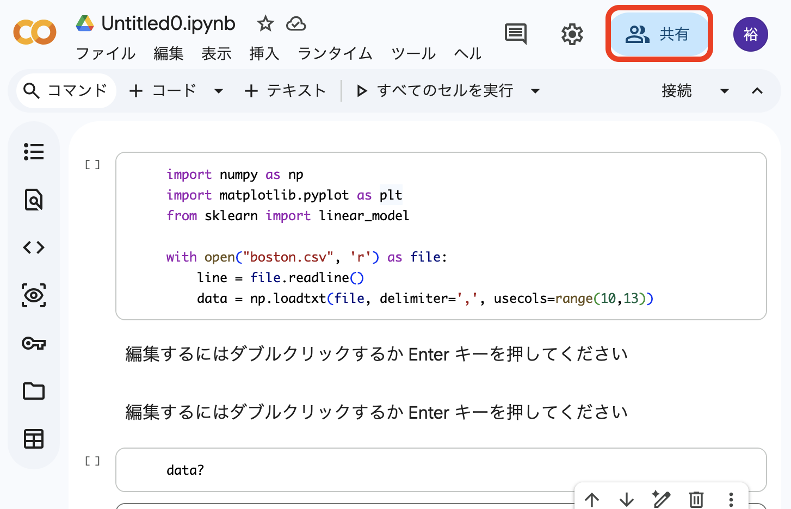
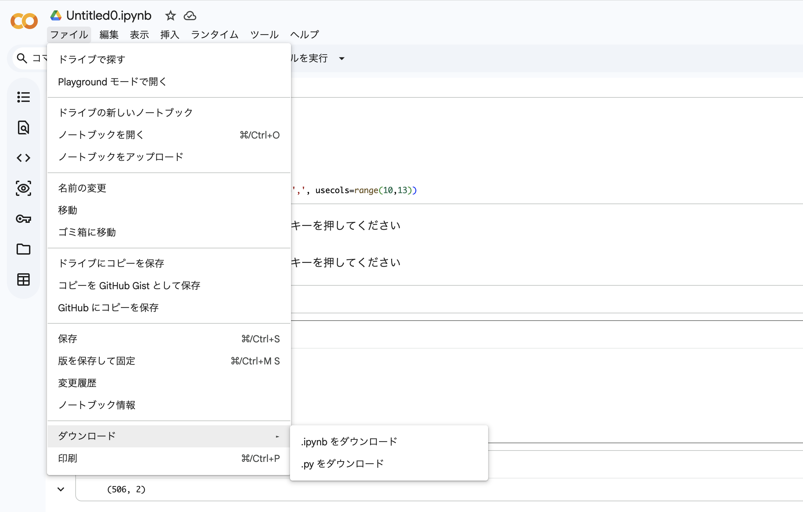

# レポートの作成・提出に関する注意点

***


## 1. texでのレポート作成

レポートのテンプレートTexファイルです．

テンプレートの書き方はあくまで例なので，各自書きやすいように構成を変更してください．  
レポート作成の際には，内容として

- 解析の目的
- データの説明，解析手法
- 結果
- 考察
 
を入れるようにしてください．

### 使い方

Linux，MAC OSの場合，terminal で以下を入力

```sh
$ platex report.tex
```

これで `report.dvi` ファイルなどが作られる．その後，以下を入力．

```sh
$ dvipdfmx report.dvi
```

これで `report.pdf` が作られる．

他に，オンラインLatexエディタでtexファイルからPDFファイルを作成することができる．詳しくは自身で検索すること．

- [Overleaf](https://ja.overleaf.com)  
- [CloudLaTex](https://cloudlatex.io)

***


## 2. Google Colabの共有リンクの取得方法

Google Colabのコードの共有リンクを取得する方法は以下の通りです．

1. Google Colabの画面右上にある`共有`ボタンをクリック．



2. ポップアップウィンドウの`リンクを取得`から`リンクを知っている全員に変更`をクリック．


4. 'リンクをコピー'ボタンをクリックして共有リンクのURLを取得する
5. '完了'をクリック．


## 3. Google Colab からノートブックをダウンロードする方法

1. Google Colab上で提出予定のノートブックを開く

2. 左上の「ファイル」の「ダウンロード」から「.ipynbをダウンロード」を選択し，ダウンロードします． 



3. ダウンロードした ipynb ファイルのファイル名を以下の形式に変更して提出してください．

    - 回帰のレポート：学籍番号+"_No1.ipynb"  (例:学籍番号が 99TI999 の場合，ファイル名は 99TI999_No1.ipynb)
    - 識別のレポート：学籍番号+"_No2.ipynb"  (例:学籍番号が 99TI999 の場合，ファイル名は 99TI999_No2.ipynb)
    - クラスタリングのレポート：学籍番号+"_No3.ipynb"  (例:学籍番号が 99TI999 の場合，ファイル名は 99TI999_No3.ipynb)
    - 最終レポート：学籍番号+"_Final.ipynb"  (例:学籍番号が 99TI999 の場合，ファイル名は 99TI999_Final.ipynb)
